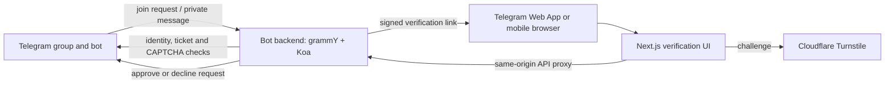

# Telegram Entry Verification Bot

Telegram Entry Verification Bot is a self-hosted bot that verifies people who request to join a Telegram group. It sends the applicant a private verification link, checks Telegram identity and a Cloudflare Turnstile challenge, then approves the original join request.

This project continues the work of [zonefile/tg-watchdog](https://github.com/zonefile/tg-watchdog) and its upstream [tg-watchdog/tg-watchdog](https://github.com/tg-watchdog/tg-watchdog). See [acknowledgements.md](acknowledgements.md) for contributor credits. It is released under the MIT License; see [LICENSE](LICENSE).

## Features

- Telegram join-request verification in a private chat, with Telegram Web App and browser fallback flows.
- Server-verified Telegram identity and Cloudflare Turnstile; signed, expiring, single-use verification tickets.
- Automatic approval or rejection of join requests, with bounded retry for transient Telegram API failures.
- Localized bot messages, a small mobile-first Next.js verification UI, and a separate long-running bot service.
- Docker Compose deployment with health checks, plus bare-metal instructions.

## Screenshots

Screenshots of the modern verification page will be added here.

## Architecture



The bot backend remains a separate process because Telegram polling, update handling, retry policy and join-request actions have their own long-running lifecycle. The Next.js app serves the verification experience and proxies browser requests to the private backend service. No database is used: short-lived ticket state is held in backend memory, so run one backend replica and be aware that a restart invalidates in-flight links.

## Quick start

1. Create a Telegram bot, configure a group with join requests enabled, and create Cloudflare Turnstile keys. Follow [SETUP.md](SETUP.md) for the full walkthrough.
2. Clone and configure:

   ```bash
   git clone https://github.com/withgardener/telegram-entry-verification-bot.git
   cd telegram-entry-verification-bot
   cp .env.example .env
   ```

3. Set the values in `.env`, then start the services:

   ```bash
   docker compose up -d --build
   ```

The web app is available on port `3000` by default. Put it behind HTTPS before using it with Telegram. Do not publish the backend port to the Internet.

## Configuration

Compose reads the root `.env` file. Important settings are the Telegram bot token and username, `PUBLIC_BASE_URL`, a random `VERIFICATION_SECRET`, the Cloudflare Turnstile secret and public site keys, and the optional `FRONTEND_PORT`. There is no database URL because this application has no database. See [SETUP.md](SETUP.md#4-environment-variables) for every setting and security guidance.

## Development

Use Node.js 24 LTS. For local development, copy the root `.env.example` to `backend/.env` and change its `PORT` to `3001`; copy `frontend/.env.example` to `frontend/.env.local`. The bot requires valid Telegram and Turnstile settings to start, while the frontend can be exercised against a local mock backend.

```bash
cd backend
npm ci
npm run dev
```

In another terminal:

```bash
cd frontend
npm ci
npm run dev
```

Available package scripts:

```text
dev  lint  typecheck  test  build
```

The frontend also provides `npm run smoke` after a production build. Backend tests use mocked Telegram and CAPTCHA adapters; they do not require a live bot. The GitHub Actions workflow runs install, lint, typecheck, tests and build for both packages.

## Updating

```bash
git pull
docker compose build
docker compose up -d
docker compose logs -f
```

There are currently no database migrations. Back up your deployment `.env` securely before upgrading; never add it to Git.

## Credits

This repository is derived from [zonefile/tg-watchdog](https://github.com/zonefile/tg-watchdog), itself based on [tg-watchdog/tg-watchdog](https://github.com/tg-watchdog/tg-watchdog). Original author and contributor attributions are retained in [LICENSE](LICENSE), [acknowledgements.md](acknowledgements.md), and the imported Git history.

## License

[MIT](LICENSE), copyright 2022 Astrian Zheng and contributors.
